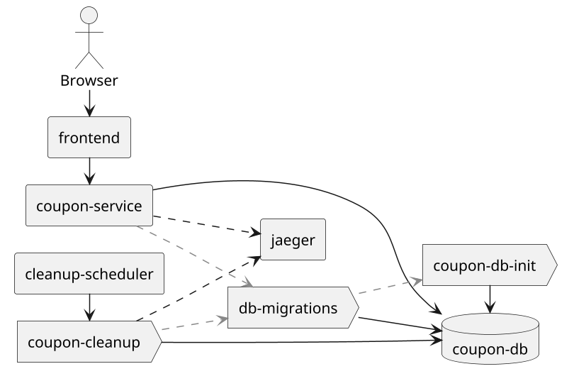

# Application Architecture

`coupon-kotlin` is a Gradle multi-module project. Each Gradle module is an independent
deployable (where applicable) with a focused responsibility, glued together by a thin
shared `configuration` module and a versioned data contract in `model`.

## Component diagram

The following diagram illustrates the high-level interaction between the system components.
It highlights the separation between the user-facing frontend, the core business logic in the
coupon service, and the background cleanup and migration tasks. For a detailed view of networking
and port mapping, see [Getting Started → Docker & Ports](../getting-started/docker-and-ports).



## Module tree

```text
coupon-kotlin/
├── model              ── shared DTOs, BSON documents, serializers
├── configuration      ── MongoClient + codec registries
├── db-migrations      ── stand-alone schema migrator (jar + container)
├── service            ── coupon REST API (Ktor)
├── cleanup            ── scheduled cleanup runner (Ktor)
├── frontend           ── Vue 3 + Vite UI
└── documentation      ── this Docusaurus site
```

### Key dependencies (from `gradle/libs.versions.toml`)

| Module          | Stack                             | Notable libraries                                                |
|-----------------|-----------------------------------|------------------------------------------------------------------|
| `model`         | Kotlin JVM                        | `kotlinx-serialization-json` 1.8.0, `mongodb-bson` 5.6.4         |
| `configuration` | Kotlin JVM (test fixtures)        | `mongodb-driver-kotlin-coroutine` 5.6.4, Testcontainers 1.21.4   |
| `db-migrations` | Kotlin JVM (`application` plugin) | MongoDB driver 5.6.4, kotlin-logging 8.0.01                      |
| `service`       | Ktor 3.4 + Netty                  | Koin 4.2.0, OpenTelemetry 1.47.0, ktor-server-request-validation |
| `cleanup`       | Ktor 3.4 + Netty                  | Koin 4.2.0, OpenTelemetry, runs as one-shot job under Ofelia     |
| `frontend`      | Vue 3 + Vite                      | TypeScript, npm                                                  |
| `documentation` | Docusaurus 3.7                    | `docusaurus-theme-openapi-docs`, PlantUML, Mermaid               |

Gradle drives the JVM modules with a JDK 25 toolchain (configured in the root
`build.gradle.kts`) and Java 25 is pinned via `.sdkmanrc`.

## Module responsibilities

### `service` — REST API

Ktor application exposing `POST /coupons`, `POST /coupons/bulk`, `GET /coupons`. It wires:

- **Koin** for DI (`MongoClient`, `MongoDatabase`, `CouponRepository`, `CouponService`).
- **`ContentNegotiation`** with a custom `Json` configuration (see `serviceJson`).
- **`RequestValidation`** with `validateCouponDto()` rules (
  see [API Examples](../development/module-reference#dto-validation)).
- **`TraceIdHeaderPlugin`** — surfaces the active OpenTelemetry trace ID as the
  `X-Trace-Id` response header. See [Tracing & Observability](../development/tracing-observability).
- **`StatusPages`** — maps validation, business and unhandled exceptions to typed `ErrorDto`s.
- **Swagger UI** at `/swagger`, served from the same OpenAPI spec rendered in this site.
- **`MongoMigrations.runMigrations()`** is invoked on startup so a fresh database is
  schema-correct without an external orchestration step.

### `cleanup` — scheduled runner

A second Ktor application that doesn't expose REST routes. On `ServerReady` it kicks off
a `CleanupRunnerJob` via `runBlocking`, then exits. In Docker Compose it is paired with
[`mcuadros/ofelia`](https://github.com/mcuadros/ofelia), which `docker exec`s the
container on a cron schedule (`CLEANUP_CRON`, default `0 30 * * * *`).

### `db-migrations` — schema steward

A stand-alone Kotlin executable (`it.schwarz.coupon.migrations.MainKt`). It supports two
entry points:

1. **As a container.** `docker compose` runs `db-migrations` to completion before
   starting `coupon-service`/`cleanup` (`condition: service_completed_successfully`).
2. **Programmatically.** `MongoMigrations.runMigrations()` reads `MONGODB_URI` /
   `DATABASE_NAME` from system properties or env vars, so the `service` and `cleanup`
   apps re-run idempotent migrations on startup.

See the dedicated page: [Database Migrations](../development/database-migrations).

### `model` — wire format

DTOs (`CouponDto`, `CouponListDto`, `ErrorDto`), BSON documents, mappers between the two,
and a shared `couponSerializersModule` configuring contextual serializers for `ObjectId`,
`BigDecimal` and `Instant`.

### `configuration` — MongoDB plumbing

Thin module that builds a `MongoClient` with the codec registry needed for
`kotlinx.serialization` and Java time / BSON types. Provides Java test fixtures so
integration tests in any module can spin up a real MongoDB via Testcontainers.

### `frontend` — UI

Vue 3 + Vite with TypeScript. Talks to the `service` API on port `8082` and surfaces
trace IDs returned in the `X-Trace-Id` header.

## Architecture decisions

### `db-migrations` as an external module

**Decision.** Schema management is its own Gradle module, packaged as a runnable jar **and**
exposed via a callable `MongoMigrations.run(...)` function.

**Why.**

- **Clean separation in Compose.** `db-migrations` runs as a one-shot container that
  must complete successfully (`service_completed_successfully`) before `coupon-service`
  and `cleanup` start. This guarantees a schema-correct database without the apps racing
  the migrator.
- **No double-deployment trap.** Each migration is recorded in `schema_migrations`
  before it is considered applied; both the container and the in-process call short-circuit
  on already-applied IDs, so calling `runMigrations()` from app startup is safe and
  idempotent.
- **Programmatic invocation for tests and embedded mode.** Integration tests can boot
  Mongo via Testcontainers and call `MongoMigrations.run(uri, dbName)` directly. Same
  helper is used by `service` and `cleanup` on startup so a developer running them in
  the IDE doesn't need to start the migration container first.
- **Single source of truth.** Migrations live in Kotlin alongside the rest of the codebase
  rather than as raw `.js` files driven by a third-party tool — a deliberate choice given
  the small migration count and the team's familiarity with Kotlin.

### Other recent decisions

- **Hook migration script on cleanup and service startup.** Both apps now invoke
  `MongoMigrations.runMigrations()` from their respective `Application.configure*()` paths
  so the same code base works whether the orchestrator is Compose (container) or an
  in-IDE run.
- **Validation moved into `RequestValidation` plugin.** `validateCouponDto()` is
  installed via the Ktor request-validation plugin so the contract is enforced uniformly
  for `POST /coupons` and `POST /coupons/bulk`. Errors flow through `StatusPages` as
  `ErrorDto`s.
- **OpenAPI is the single API contract.** The Ktor side serves
  `service/src/main/resources/openapi/documentation.yaml` from `/swagger`. This site
  renders the same file via `docusaurus-plugin-openapi-docs` to avoid drift.
- **Per-module IntelliJ run configs.** `Service`, `Cleanup` and `Frontend` are committed
  under `.run/` so a fresh checkout has everything wired up — including the OpenTelemetry
  Java agent on the Ktor apps.
