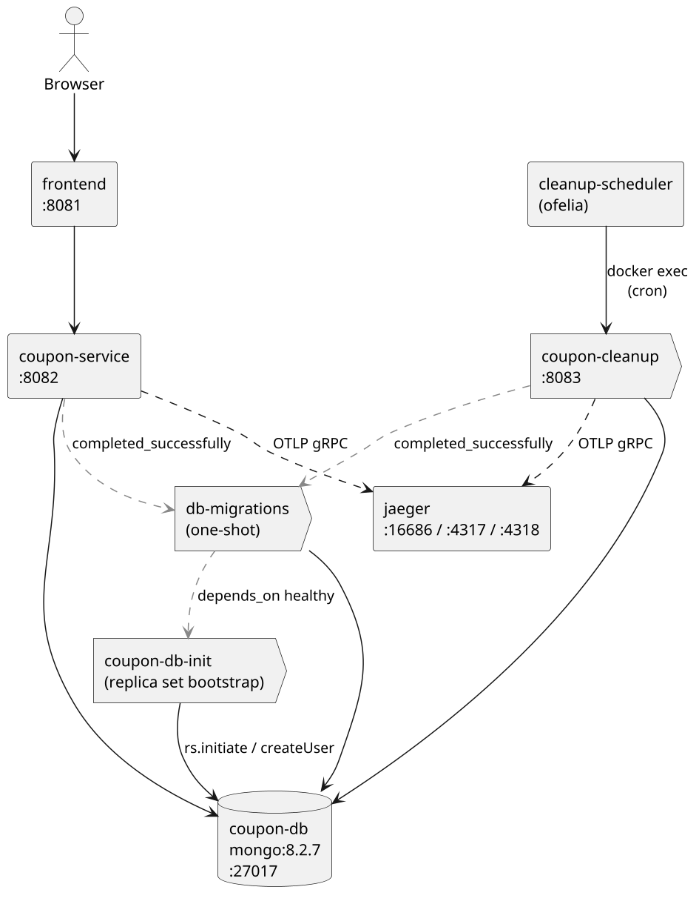

# Docker & Ports

`docker-compose.yml` orchestrates seven services. Ordering is enforced through
`depends_on` conditions — the migrator must complete successfully before any app starts,
and the Mongo replica set has to be healthy before the migrator runs.

## Compose dependencies

## Port table

| Service          | Container         | Host port | Purpose                                       |
|------------------|-------------------|-----------|-----------------------------------------------|
| Frontend         | `coupon-frontend` | **8081**  | Vue 3 UI                                      |
| Coupon service   | `coupon-service`  | **8082**  | REST API (Swagger UI at `/swagger`)           |
| Cleanup          | `coupon-cleanup`  | **8083**  | Cleanup runner endpoint (triggered by Ofelia) |
| MongoDB          | `coupon-db`       | **27017** | Mongo replica set `coupon-db-rs`              |
| Jaeger UI        | `jaeger`          | **16686** | Trace search & timelines                      |
| Jaeger OTLP gRPC | `jaeger`          | **4317**  | OpenTelemetry exporter target                 |
| Jaeger OTLP HTTP | `jaeger`          | **4318**  | OTLP/HTTP (alternative exporter)              |

## Environment

Each app loads an env file from its module:

- `service/local.env` — `MONGODB_URI`, `DATABASE_NAME`, OTel exporter endpoint.
- `cleanup/local.env` — same variables plus cleanup-specific tuning (e.g. TTL).
- `db-migrations` — receives `MONGODB_URI` and `MONGODB_DATABASE` directly from
  `docker-compose.yml`.

The Compose file also overrides `MONGODB_URI` / `OTEL_EXPORTER_OTLP_ENDPOINT` so that
the apps reach the in-network names (`coupon-db`, `jaeger`) instead of `localhost`.

## Bootstrap order

1. **`coupon-db`** starts; its healthcheck pings `db.adminCommand({ping:1})`.
2. **`coupon-db-init`** waits for health, then runs `rs.initiate(...)` and creates the
   `admin/admin` root user. It uses retry loops so it tolerates first-boot races.
3. **`db-migrations`** runs `java -jar db-migrations.jar`, applying any pending
   migrations from `MongoMigrations`. Exits 0.
4. **`coupon-service`** and **`coupon-cleanup`** start in parallel, both waiting on
   `db-migrations: service_completed_successfully`.
5. **`frontend`** waits on `coupon-service`.
6. **`cleanup-scheduler`** (Ofelia) starts last and `docker exec`s `coupon-cleanup` on
   the `CLEANUP_CRON` schedule (default `0 30 * * * *`).

## A note on Dockerfiles (DevOps)

Each JVM module ships its own Dockerfile (`service/Dockerfile`, `cleanup/Dockerfile`,
`db-migrations/Dockerfile`) and the frontend has one too (`frontend/Dockerfile`). These
are tuned for **local development** — predictable layout, easy to grep, fine to rebuild
on every `compose up`.

For production builds we'd want to swap the hand-written Dockerfiles for a Gradle-driven
image-builder so the result is reproducible from the build graph and doesn't drift from
`gradle/libs.toml`:

- [**Google Jib**](https://github.com/GoogleContainerTools/jib) — daemonless, layered
  images straight from the JVM modules; well integrated with Gradle.
- [**Palantir docker-gradle-plugin**](https://github.com/palantir/gradle-docker) — wraps
  `docker build` but lets the Dockerfile inputs come from Gradle outputs.

Either is a small migration: the modules already produce a runnable jar via the
`application` / Ktor plugins.

